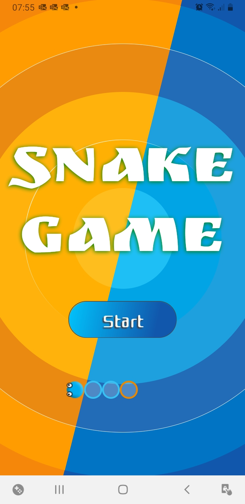
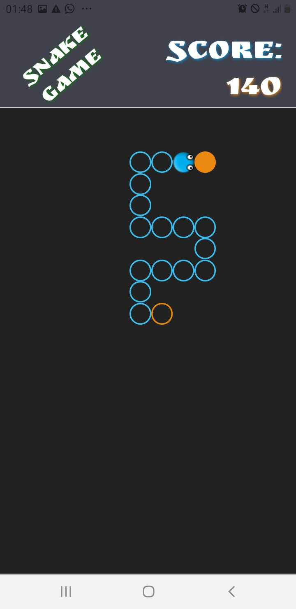
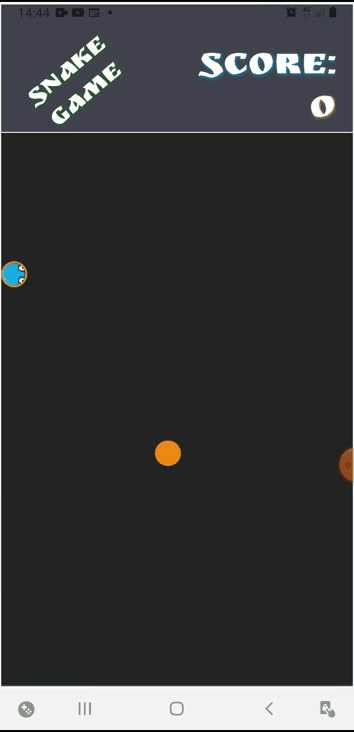

<h1 align="center">Snake Game</h1>

<p align="center" id="sobre">Jodo da serpente, onde a cobra precisa comer para crescer. Quanto mais comida pegar, maior vai ficar.</p>

<p align="center">
 <a href="#sobre">Sobre</a> •
 <a href="#tecnologias">Tecnologias</a> • 
 <a href="#teste">Teste</a> • 
 <a href="#demostracao">Demonstração</a>
</p>

<h2 align="center" id="demonstracao">Demonstração da Aplicação</h2>
<h2 align="center">
  
  
  
</h2>

<h2 align="center">
  
</h2>

<h2 align="center">
  
</h2>

<h4 align="center"> 
🚀 Publicado no Google Play... <a href="https://play.google.com/store/apps/details?id=com.opera3000.snake"> SnakeGame </a> 🚧
</h4>

<h2 align="center" id="tecnologias"> 🛠 Tecnologias </h2>

As seguintes ferramentas foram usadas na construção do projeto:

- [Expo](https://expo.io/)
- [Node.js](https://nodejs.org/en/)
- [React](https://pt-br.reactjs.org/)
- [React Native](https://reactnative.dev/)
- [Game-engine](https://www.npmjs.com/package/react-native-game-engine)

<h2 align="center" id="teste"> 🎲 Testar a aplicação em sua maquina</h2>

<h3>Pré-requisitos</h3>


Antes de começar, você vai precisar ter instalado em sua máquina as seguintes ferramentas:
[Git](https://git-scm.com), [Node.js](https://nodejs.org/en/). 
Além disto é bom ter um editor para trabalhar com o código como [VSCode](https://code.visualstudio.com/)


```bash

$ git clone https://github.com/valdir-alves3000/snake-game.git

# Acesse a pasta do projeto no terminal/cmd
$ cd snake-game

# Instale as dependências
$ Yarn install

# Execute a aplicação em modo de desenvolvimento
$ yarn start

# O servidor inciará na porta: 19002 - acesse  http://localhost:19002
```
