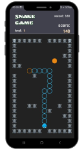

# Snake Game

<p align="center">
  
  
  
  
  
</p>

O **Snake Game** é um jogo clássico onde você controla uma cobra que cresce conforme consome alimentos. O desafio aumenta à medida que a cobra fica maior, e o jogador deve evitar colidir com as paredes, com o inimigo ou com o próprio corpo.

## Sobre o Jogo

Neste jogo de habilidade, o objetivo é simples: comer o máximo de alimentos possível para aumentar a pontuação. Conforme a cobra come, ela cresce e o jogo se torna mais difícil. O jogador precisa ser ágil e preciso para evitar colisões e alcançar a maior pontuação possível.

## Tecnologias Utilizadas

As seguintes tecnologias e ferramentas foram utilizadas no desenvolvimento deste projeto:

- Expo
- Node.js
- React Native
- React Native Game Engine

## Como Jogar

1. Deslize o dedo na tela para controlar a direção da cobra.
2. Coma os alimentos para crescer.
3. Evite colidir com as paredes com o corpo da cobra ou com a caveira.
4. Quanto mais você come, maior a cobra e mais difícil fica o jogo.
5. Tente bater o seu recorde e sobreviver o maior tempo possível!

## Teste a Aplicação

### Pré-requisitos

Antes de começar, certifique-se de que você tenha as seguintes ferramentas instaladas em sua máquina:

- [Git](https://git-scm.com)
- [Node.js](https://nodejs.org)

Além disso, é recomendável ter um editor de código como [VSCode](https://code.visualstudio.com/).

### Rodando o Projeto

Siga os passos abaixo para testar a aplicação localmente:

```bash
# Clone este repositório
$ git clone https://github.com/valdir-alves3000/snakegame.git

# Acesse a pasta do projeto no terminal/cmd
$ cd snakegame

# Instale as dependências
$ npm install

# Instale o Expo CLI globalmente (se ainda não tiver instalado)
$ npm install -g expo-cli

# Execute a aplicação em modo de desenvolvimento
$ npm start

# Escaneie o QR code com o aplicativo Expo Go no seu dispositivo físico.
# Ou utilize um emulador/simulador para testar seu app.
# Para rodar o app diretamente no navegador, pressione 'W'.
```

## Publicação

O jogo está disponível para download na Google Play Store. Acesse o link abaixo para baixar o jogo:

- [Baixar Snake Game](https://play.google.com/store/apps/details?id=com.opera3000.snakegame)